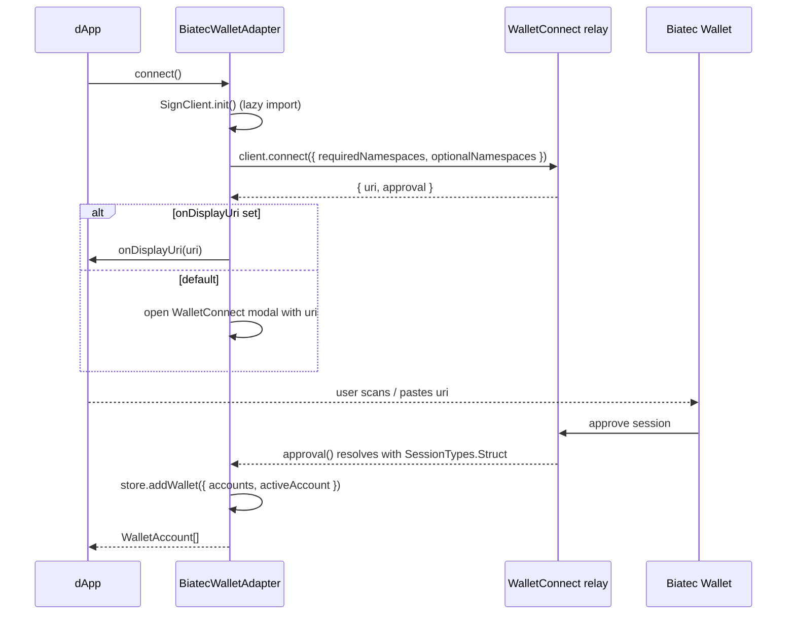
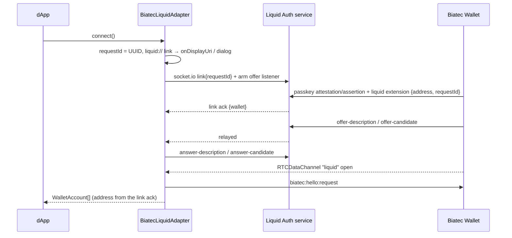

# Architecture

How `BiatecWalletAdapter` (`src/adapter.ts`) fits into `@txnlab/use-wallet` and talks to Biatec
Wallet. For the researched background this design is based on, see [RESEARCH.md](RESEARCH.md).

## Why a standalone adapter

`@txnlab/use-wallet` v5 has two ways to add a wallet that isn't built in:

1. `custom({ provider })` — implement a small `CustomProvider` interface. Fast, but the wallet id
   is always `'custom'` (one slot total), and the provider has no access to the manager's store,
   logger, or per-network config.
2. A real adapter extending `BaseWallet` — what every official wallet (Pera, Defly, Lute, …) does.
   Stable id, full store/network access, works unmodified with every framework binding.

We use (2). We also don't subclass the official `@txnlab/use-wallet-walletconnect` adapter, even
though the transport is the same WalletConnect v2 client — that adapter's `client`/`session`
fields are `private`, so nothing outside it can add ARC-0060 support or the multi-chain session
behavior described below. `BiatecWalletAdapter` reimplements the same transaction-signing flow
(same wire format, same helper functions from `@txnlab/use-wallet/adapter`) and adds `signData()`
and eager multi-chain negotiation on top.

## Session lifecycle

- `client.connect()` is called with a **required** namespace (the active network's chain id,
  `algo_signTxn` only) and an **optional** namespace (every configured chain, plus
  `algo_signData`, plus `chainChanged`/`accountsChanged` events). Requiring only the bare minimum
  keeps the adapter compatible with any wallet version; the optional namespace is what lets a
  single session cover multiple chains and ARC-0060 without a second approval prompt — see
  [Multi-chain sessions](#multi-chain-sessions) below.
- `SignClient` and `WalletConnectModal` are dynamically `import()`ed inside `connect()` /
  `resumeSession()`, never at module load. This keeps the adapter importable in SSR / test
  environments where `window` doesn't exist, and defers ~150 KB of WalletConnect code until a user
  actually tries to connect.
- On success, accounts come from `session.namespaces.algorand.accounts` — CAIP-10 strings like
  `algorand:SGO1GKSzy...:ABCD...`. The same address can appear once per approved chain; the
  adapter de-duplicates by address before storing them.

### Resuming a session

`resumeSession()` (called by `WalletManager.resumeSessions()` on app load, or automatically by
`WalletProvider`/`WalletManagerPlugin` in framework bindings) does nothing if there's no persisted
wallet state. If there is, it initializes the `SignClient` (which reads its own session cache from
`localStorage`) and re-adopts the most recent live session. If the relay has no matching session
left (e.g. the user revoked it from inside Biatec Wallet), the adapter disconnects cleanly instead
of leaving stale state behind.

### Disconnecting

`disconnect()` sends a WalletConnect `disconnect` request (reason code `6000`, "User
disconnected") and clears the wallet's entry from the `WalletManager` store. It also happens
automatically if Biatec Wallet ends the session on its side — the adapter listens for the
WalletConnect `session_delete` event and calls the same store-clearing logic.

## Multi-chain sessions

Algorand, Voi, and Aramid are separate CAIP-2 chains, but a WalletConnect session is negotiated
once at `connect()` time. Without extra care, switching `WalletManager.setActiveNetwork(...)`
would leave the adapter connected to a session that never requested the new chain, and every
signing call would fail.

`BiatecWalletAdapter.supportedChainIds` solves this by collecting **every** chain id the
`WalletManager` currently knows about (`caipChainId` on each configured `NetworkConfig`) plus any
extra ids from `options.chains`, and requesting all of them as _optional_ chains in the same
`connect()` call. Biatec Wallet approves whichever of them it recognizes for the connected
accounts. As a result:

- `setActiveNetwork('voimain')` after connecting on `'testnet'` works immediately — no reconnect,
  no new approval prompt — as long as `voimain` was registered on the manager (and therefore had a
  `caipChainId`) _before_ `connect()` was called.
- Adding a network _after_ connecting requires a reconnect, since the already-approved session
  doesn't know about the new chain.
- `signTransactions()` / `signData()` always send the WalletConnect request with
  `chainId: this.activeChainId` — the chain the request is scoped to is whatever
  `WalletManager.activeNetwork` currently is, read fresh on every call.

## Transaction signing (ARC-0001)

`signTransactions(txnGroup, indexesToSign?)`:

1. Normalizes input (either `algosdk.Transaction[]` or encoded `Uint8Array[]`, and either a flat
   group or an array of groups) via `@txnlab/use-wallet/adapter`'s `flattenTxnGroup` /
   `isTransactionArray`.
2. For each transaction, decides whether Biatec Wallet should actually sign it: the position must
   be selected by `indexesToSign` (if provided) **and** its sender must be one of the adapter's
   connected `accounts`. Everything else is sent as `{ txn: base64, signers: [] }` — the ARC-0001
   signal for "don't sign this one" — so group transactions belonging to other parties pass
   through untouched.
3. Sends a single `algo_signTxn` JSON-RPC request (via `formatJsonRpcRequest`) over the active
   session's `client.request()`, scoped to `activeChainId`.
4. Maps the response back positionally: `null` for every `signers: []` position, the next signed
   transaction bytes (base64 → `Uint8Array`, or already an array/Uint8Array) for every signable
   position.

`transactionSigner` (used by `algosdk.AtomicTransactionComposer`) is inherited unchanged from
`BaseWallet` — it just calls `signTransactions` and strips the `null`s.

## Data signing (ARC-0060)

`signData(data, metadata)` builds the ARC-0060 `StdSignData` payload via the shared
`BaseWallet.createStdSignData()` helper (`@txnlab/use-wallet` resolves the signer's real public
key through algod — following a rekeyed account's auth address — and sets `domain =
location.host`, `authenticatorData = SHA-256(domain)`), base64-encodes every byte field for the
wire, and sends a single-item `algo_signData` request. Biatec Wallet independently verifies that
`authenticatorData` actually hashes the claimed `domain`, and that `domain` matches the
WalletConnect session's own peer URL (so a malicious dApp can't claim a different origin) — see
[RESEARCH.md § What Biatec Wallet supports](RESEARCH.md#3-what-biatec-wallet-supports-over-walletconnect)
for the wallet-side details.

`sessionSupportsSignData` guards against calling `signData()` against an older wallet version that
never advertised `algo_signData` in the approved session — it's checked before sending the
request, distinguishing "the user's wallet doesn't support this" (`4200`) from "the user rejected
this specific request" (`4001`).

## Testing strategy

`src/adapter.test.ts` mocks `@walletconnect/sign-client` and `@walletconnect/modal` at the module
level (`vi.mock`) and drives the adapter through `@txnlab/use-wallet/testing`'s
`createTestHarness()`, which provides a real `@tanstack/store`-backed `AdapterStoreAccessor`
without needing a full `WalletManager`. This exercises the actual store-mutation logic (accounts
get de-duplicated and persisted correctly) while keeping the WalletConnect network layer
deterministic and instant. See [CONTRIBUTING.md](../CONTRIBUTING.md#tests) for how to extend it.

## Liquid Auth transport

`src/liquid/` is a second, independent adapter (`BiatecLiquidAdapter`, id `biatec-liquid`) that
replaces the WalletConnect relay with the Algorand Foundation's Liquid Auth flow:

- `protocol.ts` — pure wire format (ARC-0027 envelope, CBOR via a lazy `cbor-x` import,
  base64url, deep links). Mirrored verbatim in the wallet repository.
- `signaling.ts` — `LiquidSignalClient`: the answer-role subset of the Liquid Auth signaling
  protocol over `socket.io-client` (lazy import, websocket transport, `withCredentials`).
- `adapter.ts` — session lifecycle, request/response correlation with timeouts, ARC-0001 and
  ARC-0060 mapping. `resumeSession()` restores the account from the persisted
  `{ requestId, origin }` metadata and re-pairs lazily on the first request, because a WebRTC
  channel cannot survive a reload.
- `dialog.ts` — dependency-free fallback dialog (copy link) when no `onDisplayUri` is given.

The full protocol, its security model and the service deployment constraints are in
[LIQUID_AUTH_PROTOCOL.md](LIQUID_AUTH_PROTOCOL.md).
