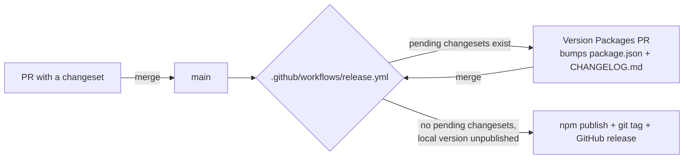

# Releasing

This package is released with [Changesets](https://github.com/changesets/changesets), the same
tool the upstream `use-wallet` monorepo's ecosystem commonly uses. Versioning and publishing are
both automated by CI — maintainers never run `npm version` or `npm publish` by hand.

## How it works



1. Every PR that changes the published package (anything under `src/`, its public API, or
   `package.json`'s `dependencies`/`peerDependencies`) includes a **changeset** — a small markdown
   file describing the change and its semver bump.
2. `.github/workflows/release.yml` runs on every push to `main`. If there are pending changesets,
   it opens or updates a PR titled **"chore: version packages"** that consumes them: bumping
   `package.json`'s `version` and writing `CHANGELOG.md` entries (via
   `@changesets/changelog-github`, which links each entry back to its PR and author).
3. Merging that PR triggers the same workflow again. This time there are no pending changesets, so
   it runs `pnpm changeset:publish` instead: this publishes any package whose `package.json`
   version isn't yet on the npm registry, pushes a `biatec-wallet-use-wallet-client@X.Y.Z` git tag,
   and (via `softprops/action-gh-release`) creates a GitHub release from that tag.

No manual tagging, no manual `npm publish`. The full test suite (`lint`, `typecheck`, `test`) runs
as part of the release workflow before either step, and `pnpm changeset:publish` runs `pnpm build`
first — a broken build or failing test blocks the release.

## Adding a changeset

```bash
pnpm changeset
```

Answer the prompts:

- Which package changed — for this single-package repo, just confirm
  `biatec-wallet-use-wallet-client` (examples are excluded, see `.changeset/config.json`'s
  `ignore` list).
- Bump type:
  - **patch** — bug fix, internal refactor, doc-only change to a published file, dependency bump
    with no API change.
  - **minor** — new option, new export, new supported network — anything additive and
    backward-compatible.
  - **major** — anything that breaks existing consumers: a removed/renamed export, a changed
    function signature, a changed default behavior.
- Summary — one or two sentences, written for the changelog. It becomes a `CHANGELOG.md` entry
  verbatim, so write it for consumers, not for the PR reviewer.

Commit the generated `.changeset/<random-name>.md` file in the same PR as the change. CI's
`changeset-check` job posts a warning (non-blocking) on PRs that touch the package without one.

A single PR can include multiple changesets (e.g. one per unrelated change), and a changeset can
list more than one bump type note if needed — see the
[Changesets docs](https://github.com/changesets/changesets/blob/main/docs/adding-a-changeset.md).

## Authentication

The publish step needs either:

- **npm trusted publishing (OIDC)** — configure it once for this package at
  <https://docs.npmjs.com/generating-provenance-statements#publishing-packages-with-provenance-via-github-actions>
  (or npmjs.com's package settings once the package exists). No secret needed; recommended.
- **`NPM_TOKEN` repo secret** — an npm automation token with publish rights, added under
  _Settings → Secrets and variables → Actions_. The workflow falls back to it automatically.

`package.json` already sets `publishConfig.provenance: true`, so provenance attestation is
attempted either way when running in GitHub Actions with the `id-token: write` permission (already
granted in `release.yml`).

## First release / bootstrapping

Changesets' publish step compares each package's local `version` in `package.json` against what's
already on the npm registry and publishes anything not yet there — it does **not** require a
changeset to perform that first publish. So the very first release just needs the release workflow
to run once on `main` with the registry not yet having `0.1.0` published; no special bootstrapping
step is needed beyond making sure npm authentication (above) is configured.

## Manual escape hatch

If CI is down or you need to publish urgently:

```bash
pnpm install --frozen-lockfile
pnpm check              # lint, typecheck, test, build, publint
npm whoami --registry=https://registry.npmjs.org  # confirm you're logged in with publish rights
pnpm changeset:version   # consumes any pending changesets locally
git add -A && git commit -m "chore: version packages"
pnpm changeset:publish   # builds, then npm publish + git tag
git push --follow-tags
```

Prefer letting CI do this — it runs the same commands with a clean, reproducible environment and
attaches provenance automatically.
